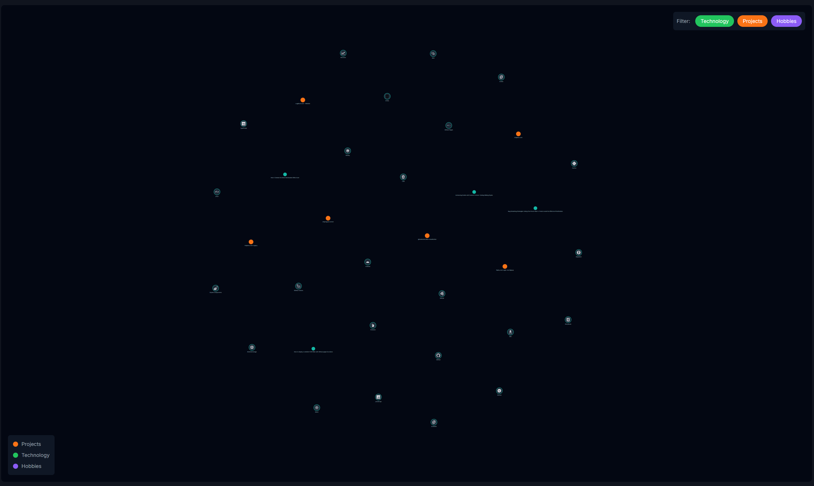

This is the first note in a new era for this website. So far I have kept the structure pretty grounded on corpo brand styles. A blog section, and about me section, pretty boring stuff. We are now going into a [[Digital Garden]] style. Pages will be connected and intertwined like wiki pages and you can explore everything like a mind map. I believe that is the best way to express myself, the things I do and how I do things.

## The Vision

- The homepage will now be a [[Graph]]. Perfect for the mind map vibe and perfect for someone who really loves [[Computer Science]].
- Everything is a note - no more "blog posts" vs "[[projects]]" distinction. No more rigid structures. Things connect organically and links will take us from ideas to projects to other ideas.
- Notes link to each other with [[wikilinks]]
- We will work on the [[graph]] visualization with cool filters and different views.
- Big hub nodes like [[svelte]] or "cars" connect to smaller notes, this will happen naturally as more notes connect to popular nodes.

## Technical Approach

Staying with [[sveltekit]] but building garden features:

- `remark-wiki-link` for parsing links
- Custom build-time [[graph]] computation
- Backlinks automatically generated
- [[d3-force]] (or similar) for the interactive graph

## The Journey

### Day 1

Decided to burn it all down (figuratively). The old site was too corporate, too "personal brand". I want something that feels alive, that grows, that connects ideas the way my brain does.

Hashing out the architecture, Key decisions:

- [[Graph]] is the homepage, not a feature
- Full [[wikilink]] syntax with backlinks
- Mobile can wait. "Best viewed with a computer."
- Everything becomes notes, even this meta-documentation

Next steps: prototype the graph computation and see how it feels, and restructure all my MD files.

### Day 2

- Upgraded to [[Svelte]] 5 and [[SvelteKit]] 2
- Installed all the [[graph]] related libraries like [[d3-force]] to build an initial version
- Experimented with filters and categorization

Next steps: organize notes, add proper tags and wikilinks to have a better looking graph.

### Day 3

- Consolidated all note scanning into a single prebuild script
- Proper parsing with `gray-matter` and `remark` instead of regex hacks
- Tags now create implicit [[graph]] edges - projects auto-link to their tech stack without needing explicit wikilinks in the body
- Went from 59 to 74 edges just from that
- Created my [[cv]] as a note with wikilinks everywhere - companies, universities, hobbies, all connected
- Built gardening scripts: `pnpm forage` finds missing notes, `pnpm sow` plants seedlings for them
- 56 seedlings waiting to be planted

Next steps: actually sow those seeds and start writing content.
