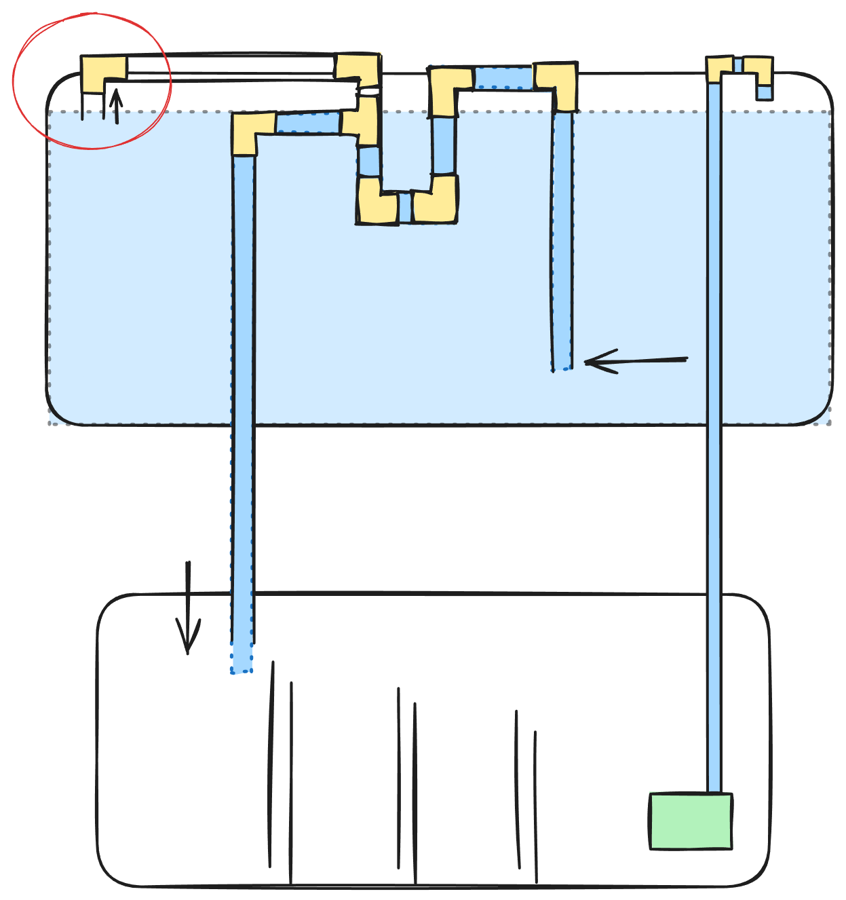
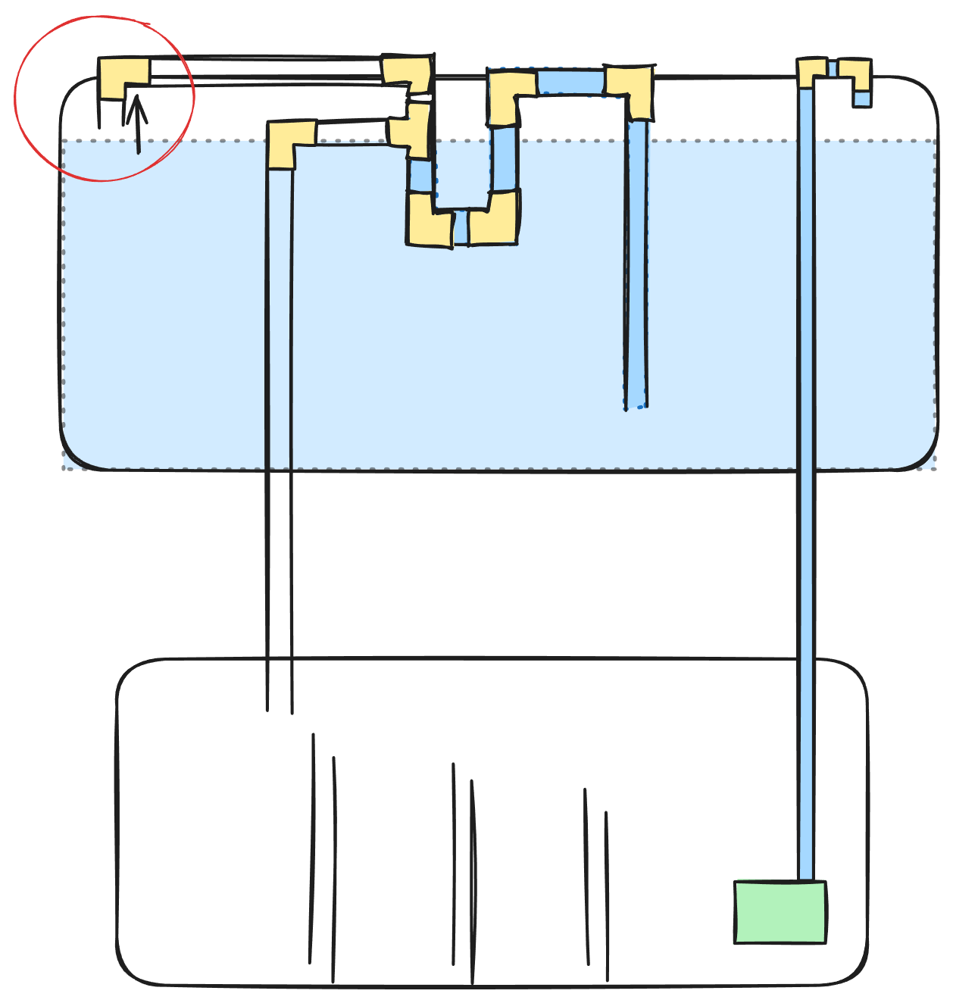
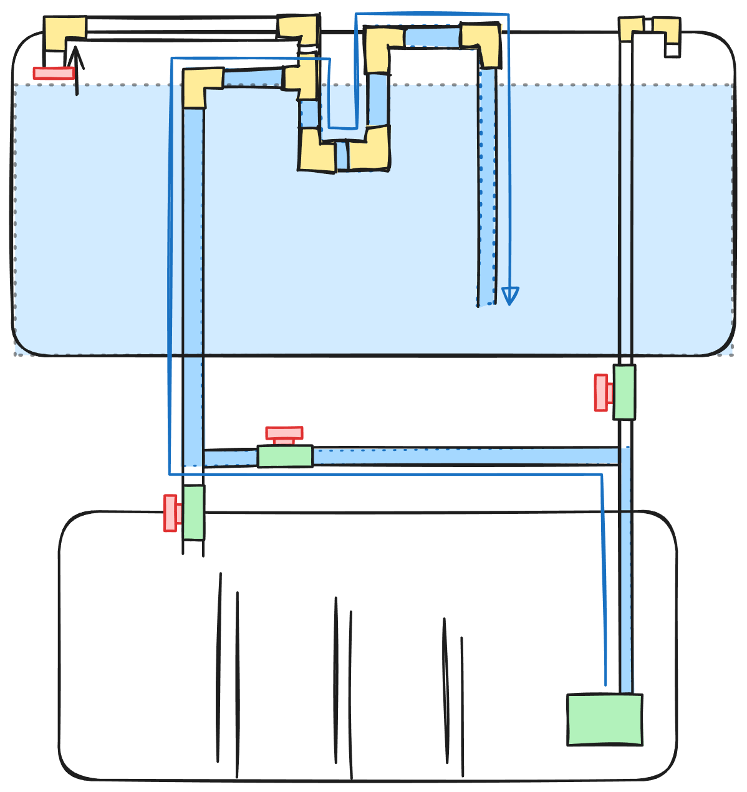

# Planted Aquarium

Another rabbit hole. Started wanting a fish tank, ended up building my own sump from glass and designing a custom overflow system.

## The Setup

**Display tank:** 100L
**Sump:** 80L (DIY - bought glass and glued it myself)
**Total system volume:** 180L

The sump has a refugium area that I built but never actually used. For now it's just filtration - mechanical and biological media doing the work.

## The Overflow System

This is the part I'm proud of. It's a siphon-based overflow (sometimes called "reverse overflow" for reasons I don't fully understand) that's completely DIY and self-regulating.

### How It Works

1. **Intake pipe** goes all the way to the bottom of the tank to catch dirty water near the substrate
2. That pipe goes **up above water level**
3. Then **down about 5 inches below water level**
4. Then **bends up again above water level**
5. At the top there's a **T connection**:
   - One end has an open pipe mouth-down, sitting just at the water surface
   - Other end goes down to the sump

   

### The Self-Regulating Magic

The T connection with the air inlet is the clever bit:

- **Water level drops** (pump off) → air inlet opens → siphon breaks → overflow stops automatically
- **Water level rises** (pump on) → air inlet submerges → siphon resumes → overflow continues

No flood risk. If power goes out, the sump won't overflow because the siphon breaks when the display water level drops. When power comes back, everything resumes automatically.

### Priming System

To start the siphon, I have a setup with my return pump and some valves. Flip the valves and instead of pumping water up to the display, it flows into the overflow piping and fills it. Once primed, flip the valves back to normal operation.

No sucking on tubes like an aquarium caveman.

## The Inhabitants

### Fish

Mostly nano community fish:

- **Black tetras**
- **Cardinal neon tetras** - the classics
- **Livewire tetras**
- **Chernobyl tetras** - officially called "tetra colors" or "monjas," these are the GMO fluorescent ones that look radioactive. The nickname fits.
- **Flying fox** - algae duty
- **Otocinclus** - tiny glass cleaners that look like mini catfish, great little workers
- **Ghost shrimp** - cleanup crew

### Plants

Low-tech approach - I grow whatever I can find:

- **Monte carlo** - spreading as a carpet
- Various random bushes

No CO2 injection yet, just letting the plants do their thing with fish waste and light.

## Lighting

Three-color LED setup - red, blue, and white. Currently on manual control, which means I'm the automation.

An Arduino setup for automated lighting schedules is on the list. Right next to all the other Arduino projects in the "someday" pile.

## Future Upgrades

- **Arduino lighting control** - automated day/night cycles, maybe sunrise/sunset ramping
- **CO2 injection** - for better plant growth and more demanding species
- **Actually use the refugium** - maybe grow some macroalgae for nutrient export

## Related

- [[Maker]] - The whole sump and overflow is DIY
- [[Electronics]] - Future Arduino automation
- [[3D Printing]] - Probably useful for custom fittings and holders
