# Dactyl Manuform Keyboard Build

The story of how "maybe I should get a smaller keyboard" turned into learning OpenSCAD, buying a 3D printer, and spending months designing a fully custom split ergonomic keyboard.

## The Rabbit Hole

It started innocently enough. I've had my Corsair K90 (the original, not the newer ones) for about 10 years. 18 macro keys, full layout, rotary volume control. It's a beast and I love it. But it's getting old, and honestly it's a pain to carry around.

So I figured I'd look into something smaller. [[LoadSmart]] had given me a free WASD keyboard back in the day, but I hated it. Brown switches feel mushy to me. I'm a linear guy, used to reds and low-effort keystrokes.

One thing led to another. r/mechanicalkeyboards led to r/ergomechkeyboards, and suddenly I was looking at curved split keyboards and thinking "yeah, I need that."

## Why Dactyl Manuform Specifically

I looked at a bunch of ergo splits: Corne, Lily58, Kyria, and others. The Dactyl Manuform won me over for a few reasons.

First, it's not really a 3D model. It's a code project. The whole thing is parametrically generated. You don't download an STL and print it; you configure a script and it generates exactly what you need. That modularity and customization tickles my engineering brain in all the right ways. It's the same reason I gravitate toward code over no-code tools.

Second, the ergonomics looked genuinely promising. The curved key wells follow your finger arcs, the thumb clusters are actually usable, and the split design lets you position your hands at shoulder width instead of hunched over a single board.

Will it actually make work more comfortable? I don't know yet. There's definitely a learning curve. Columnar layouts and thumb clusters require retraining muscle memory. But I'm willing to put in the time to find out. Spending 8+ hours a day typing makes it worth experimenting with.

## The First Attempt

A few years back I actually tried building a Dactyl Manuform. Had a friend print the case on his Ender 3. The print quality was rough, lots of artifacts, but it worked. I hand-wired the whole thing on an original Pro Micro.

I never actually daily drove it. The jankiness was too much, and I think deep down I knew I wanted to do it properly.

## Version 2: Doing It Right

This time I went all in.

### Custom Generation

The web-based Dactyl generators are fine, but I found out the Python scripts could do OLED screens. That was enough to push me into the deep end.

Two weeks of tweaking parameters. Column heights adjusted to my finger lengths. Thumb cluster angles dialed in. Every measurement considered.

Then I opened [[OpenSCAD]].

### OpenSCAD Mods

The base generated model wasn't enough. I added:
- **Custom OLED housing** - designed from scratch to fit the displays I wanted
- **Rotary encoder mount** - because volume control on the K90 spoiled me
- **Nintendo Switch analog sticks** - replacing thumb keys for mouse/scroll control

Learning OpenSCAD was its own adventure, but now I use it for all kinds of projects. The parametric modeling approach clicks with my programmer brain.

### "I'll Just Use a Print Farm"

That was the plan. Generate the files, send them off, get nice prints back.

Instead I bought a [[Bambu Lab A1]].

The logic made sense at the time. Why pay someone else when I could own the printer and make whatever I want? Classic maker brain.

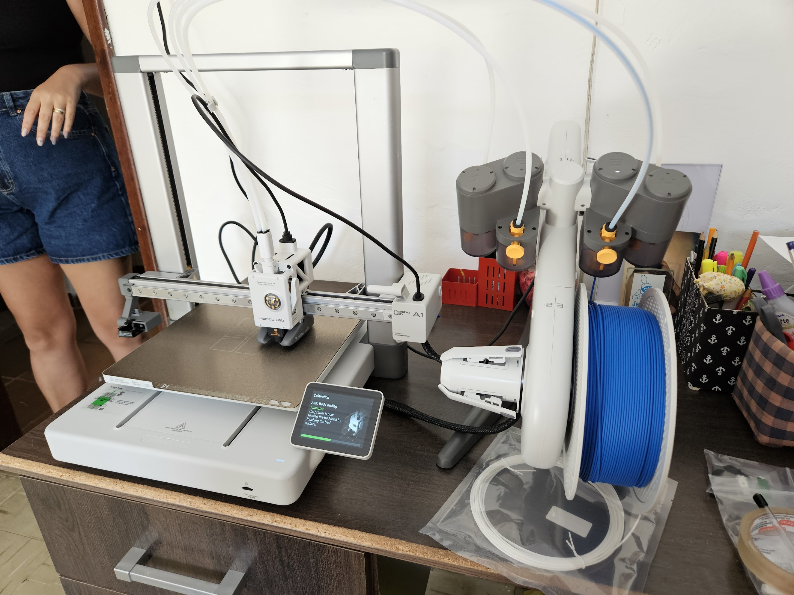

### The Print

Matte black filament. 0.08mm layer height, the finest my A1 could do. If I was going to do this, I was going to do it right.

Had a few failures along the way:
- One random layer shift ruined a 20-hour print
- One unstuck from the build plate overnight
- One I reprinted because I changed my mind about a detail

Eventually got both halves printed perfectly.

## Current Status: Right Half Hardware All Working

Matrix, all 31 RGB LEDs, and OLED confirmed working. Encoder next.

### The Color Scheme

Black and yellow to match my desk setup: KRK Rokit Classic 5 monitors and Scarlett Solo interface. The red keycap accents tie it together. Cohesive aesthetic matters when you're staring at something all day.

## Planned Features

### OLEDs
Simple yellow monochrome displays showing:
- Current layer
- Caps lock status
- Maybe Bongo Cat or Luna dog, because it's basically mandatory at this point

### Analog Sticks
Honestly not 100% sure what I'll use them for yet. Probably mouse movement and scrolling most of the time. Maybe gaming if I'm feeling stupid.

### Rotary Encoder
Volume control. Some things you don't give up.

## Parts List

| Part | Details |
|------|---------|
| Layout | 31 keys per half — 4×6 main body + extra keys + thumb cluster |
| Wiring matrix | 6×6 per half |
| Switches | Cherry MX Speed Silver |
| Keycaps | Blank DSA - black/yellow/red |
| Controller | RP2040 Pro Micro USB-C |
| LEDs | Per-key RGB (SK6812 mini) |
| OLED | 1 yellow monochrome per hand |
| Rotary encoder | 1 per hand, with push button |
| Analog stick | 1 Nintendo Switch stick per hand, with push button (L3) |
| Case | Custom OpenSCAD design, matte black, 0.08mm layers |

## What I Learned

This project taught me way more than just keyboard building:
- **OpenSCAD** - Parametric modeling that I now use everywhere
- **[[3D Printing]]** - Which led to buying my own printer
- **[[Electronics]]** - Hand-wiring, understanding matrix scanning
- **Patience** - AliExpress shipping times test a man's soul

## The Irony

I started this because I wanted something smaller and more portable than my K90.

I now have a full [[3D Printing]] setup, a custom-designed split keyboard with OLED screens and analog sticks, and several months invested in the project.

Still no daily driver keyboard though. Parts are here now, so the excuse is gone.

## Dev Log

### Entry 1: Design and Generation

Two weeks of tweaking `generate_configuration_mklasklasd.py`. Column offsets tuned to my finger lengths, thumb cluster angles dialed in, OLED clip mount configured, EXTERNAL controller tray for the RP2040. Generated the OpenSCAD files, added the custom OLED housing and encoder mount on top.

Everything now lives under `lipe-dev/keyboards` on GitHub: a parent repo with two submodules, `keyboards_dactyl-manuform` for the 3D print files and `keyboards_qmk-userspace` for the firmware.

### Entry 2: Printing

Both halves printed in matte black at 0.08mm layer height on the [[Bambu Lab A1]]. Three failed attempts before clean results: one layer shift, one adhesion failure overnight, one deliberate reprint after changing a detail.

All SCAD and print files are versioned V0–V7 in `keyboards_dactyl-manuform`, named by modification date with descriptions. The final printed file was `DM_left_V7_final`. The right hand is just V7 mirrored horizontally in the slicer — no separate SCAD needed. `DM_right.scad` exists as a reference for the original unmodified generated output and was never used for printing. `run_config.json` is backed up alongside the print files.

First look at the first printed hand of the keyboard:

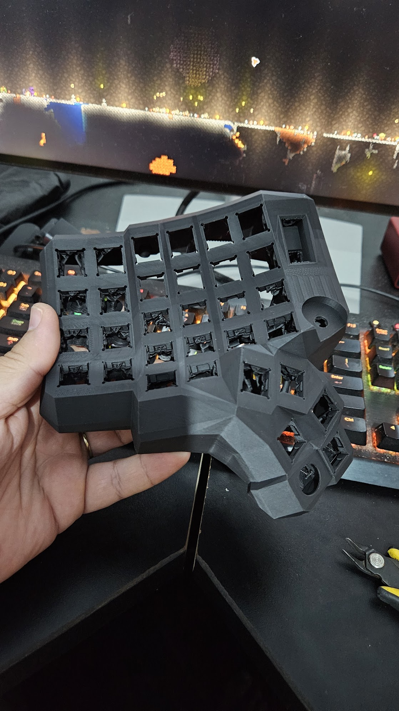

Then came the support removal. LOTS of support material to remove.

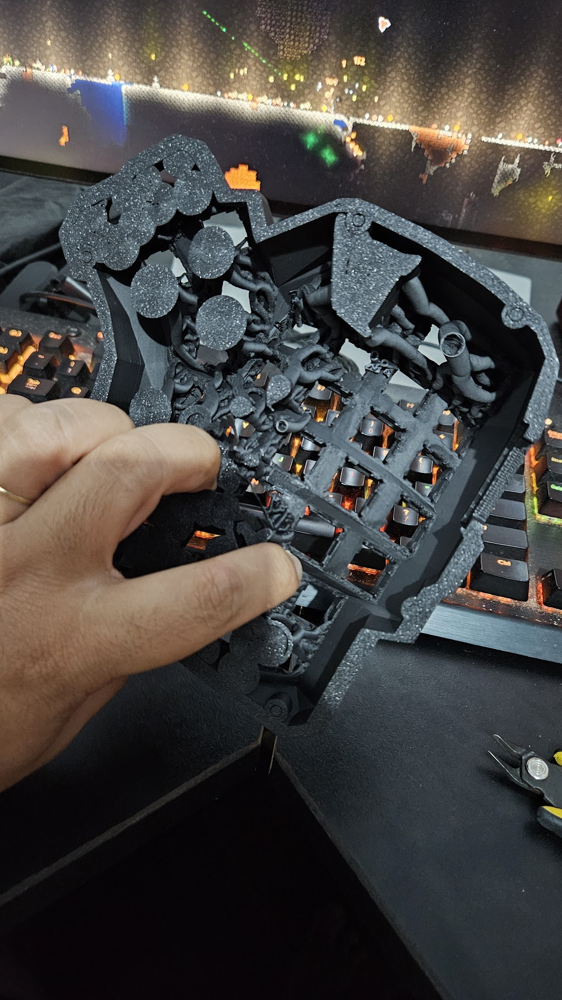

So much support material.

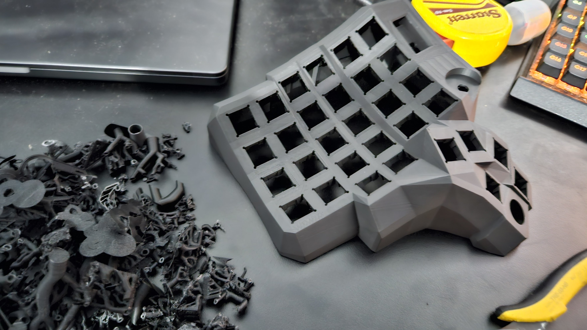

THAT WAS A LOT OF SUPPORT MATERIAL.

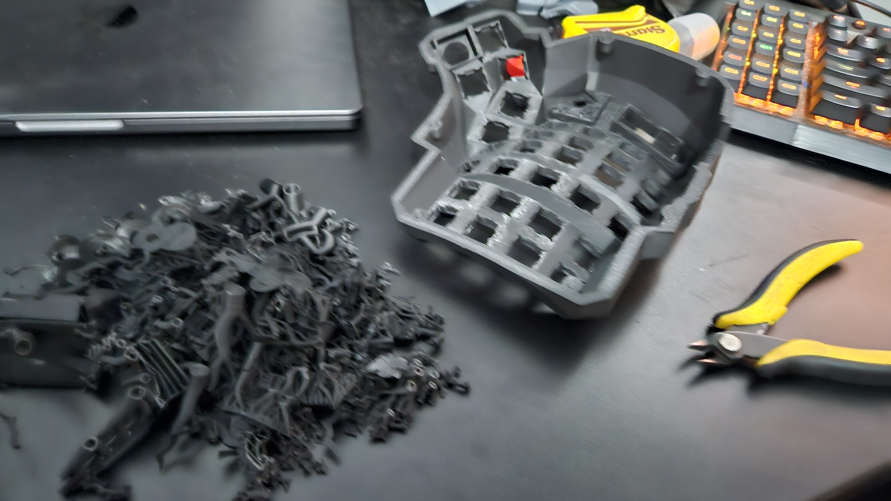

Every part got a few iterations and test prints, from analog stick holders to rotary encoder fittings and OLED screen enclosures. Way more than what's in the photo — most went straight to the bin, and the ones that survived long enough got claimed by my daughter as toys.

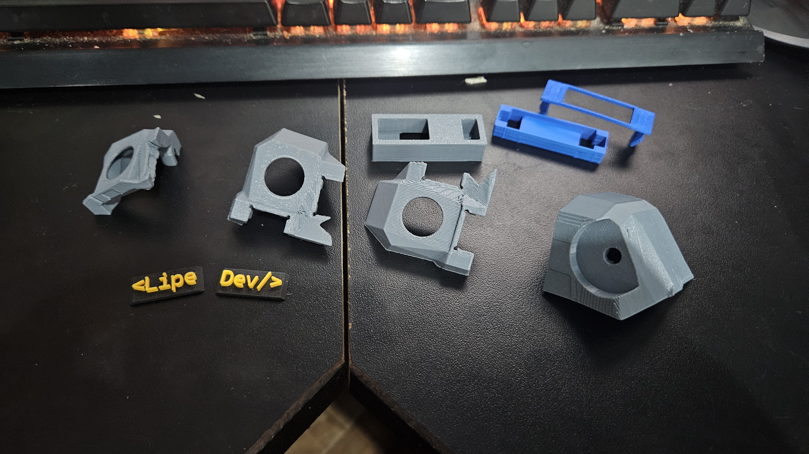

Also designed and printed the holder for the controller board, with a special place for the TRRS jack:

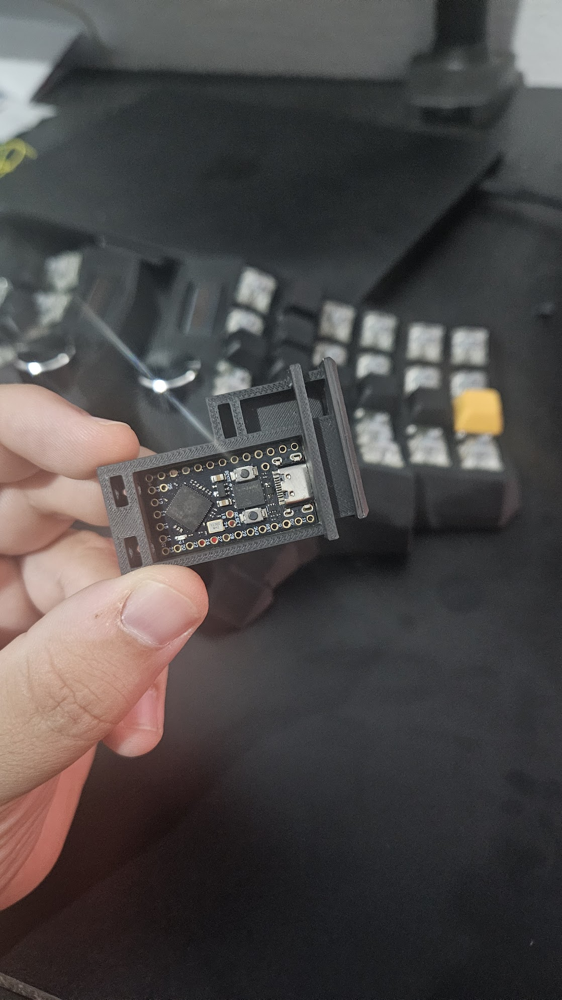

### Entry 3: Parts Arrive

Everything arrived. Cherry MX Speed Silvers, RP2040 Pro Micro, individual switch PCBs from Keycapsss, SK6812 mini per-key RGB LEDs, blank DSA keycaps in black and yellow with red accents.

### Entry 4: Assembly, Right Half

First look at the printed parts with switches and screen and rotary inserted. Just basking in it, no wiring yet.

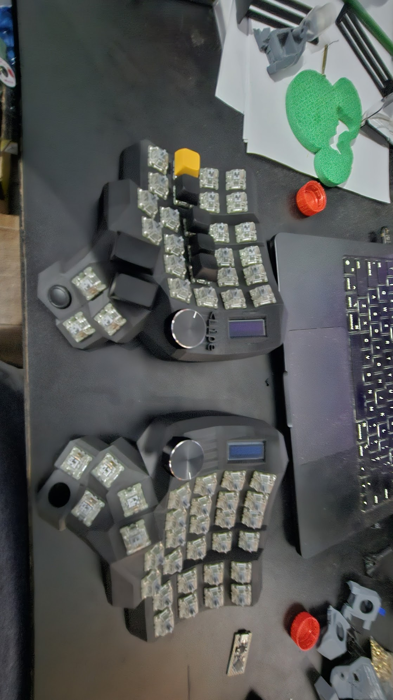

#### Soldering (right half)

First I soldered all the individual PCBs to the switches. Should have fully assembled them into the case first, but oh well.

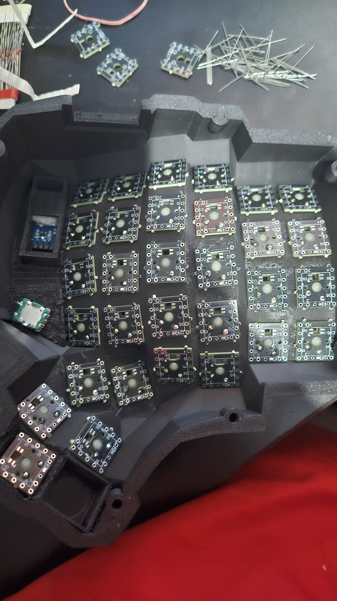

Then soldered the diodes:

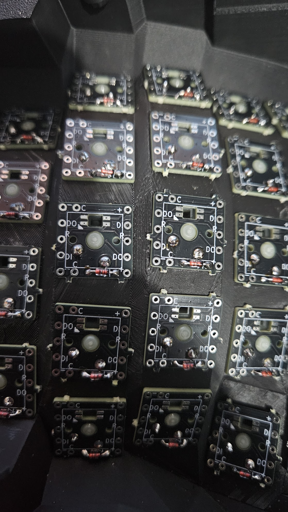

Then all the LEDs. Four solder points on each. Lots of work.

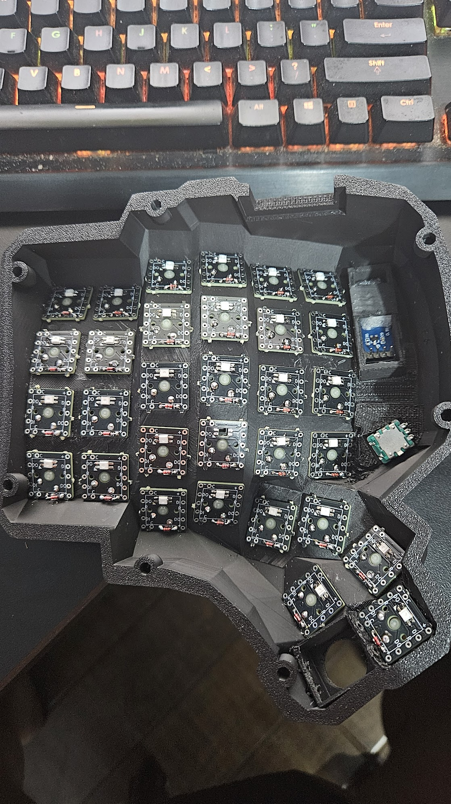

#### Wiring

Reusing the scrapped diode legs as bridges for the PCBs. Zero waste.

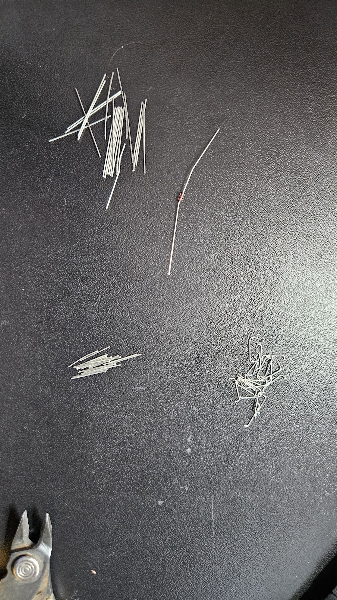

Final wiring with all the bridges inserted. Decided to go with a cool hard wire style with no insulation on them — looks like piping.

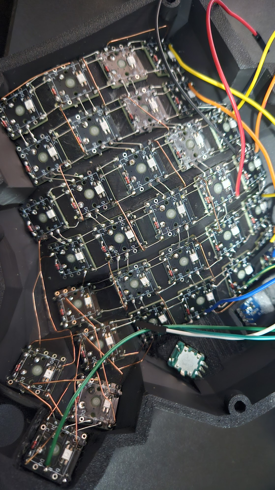

The thumb cluster area got a bit chaotic and I had to get creative:

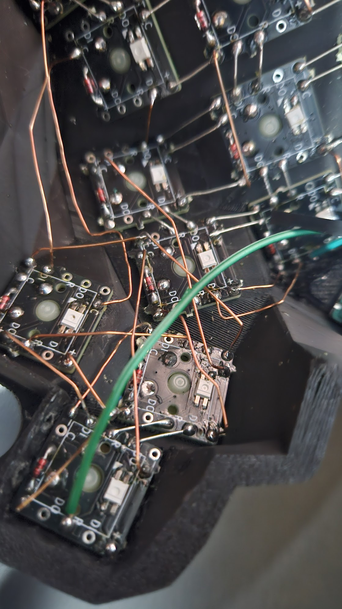

But this looks so clean!

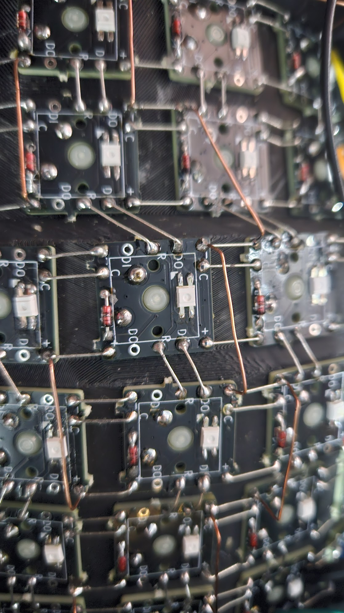

#### Wiring Matrix

The electrical matrix is 6 rows × 6 columns per half. It doesn't map 1:1 to the physical layout:

- **Rows 1–4:** 6 keys each, the main curved key well
- **Row 5:** the 2 extra keys from the middle columns plus 2 thumb cluster keys
- **Row 6:** the remaining 3 thumb cluster keys

The rotary encoder push button and analog stick L3 will be wired directly to free GPIO pins, not through the matrix. Pin assignments TBD (GP21 is now taken by RGB).

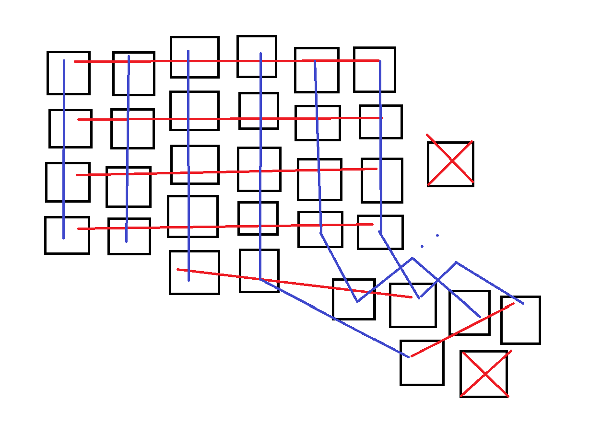

### Entry 5: Firmware, Right Half

QMK CLI installed, `qmk setup` done, userspace configured at `keyboards_qmk-userspace`. Keyboard scaffolded as `dactyl_manuform_lipe_dev`.

6×6 matrix defined with rows on GP0–GP5 and columns on GP6–GP11. Full pin assignment documented in `pinout.md`.

#### RGB

SK6812 Mini-E on GP21, LED VCC on 5V. A few things that needed manual fixing for QMK 1.2.0 on RP2040:

- `g_led_config` has to be defined manually in `dactyl_manuform_lipe_dev.c` — QMK 1.2.0 doesn't auto-generate it from JSON
- `rgb_matrix: true` in features
- WS2812 driver set to `vendor` — RP2040 needs the PIO driver, not the default bit-bang
- `solid_color` animation enabled
- `keyboard_post_init_user` in `keymap.c` forces solid red for testing

First 12 LEDs (rows 1–2) lit up, rows 2–5 silent. Chain was broken in two places: one bad LED die in row 2, one loose leg in row 4. Bypassed the bad die, resoldered the leg. All 31 LEDs working.

Note: GP21 is now the RGB data pin. The tentative GP21/GP22 assignment for encoder push button and analog stick L3 needs to move to other free pins.

#### OLED

128×32 SSD1306 (0.91"), I2C1 on GP14/GP15, driver `I2CD1`. Fix was SDA/SCL wires swapped. `mcuconf.h` needs `RP_I2C_USE_I2C1` enabled — not on by default. Shows "dactyl manuform / lipe-dev". Working.

#### Right Half Status

| Component | Status |
|-----------|--------|
| Matrix (31 keys) | ✅ |
| RGB LEDs (31) | ✅ |
| OLED | ✅ |
| Encoder | next |
| Analog stick | pending |

## What's Next

- **Entry 6:** Wire + firmware, left half. Same process as the right. Don't start until entry 5 is done.
- **Entry 7:** Connect both halves. TRRS link, split keyboard config in QMK.
- **Entry 8:** Extra features. Encoder push button and analog stick L3 direct GPIO, their own QMK mappings.

## Related

- [[Maker]] - The broader maker hobby
- [[3D Printing]] - The fabrication method (and the printer I bought for this)
- [[Electronics]] - Wiring and components
- [[OpenSCAD]] - The CAD tool I learned for this
- [[Gaming PC]] - Where this will eventually live
