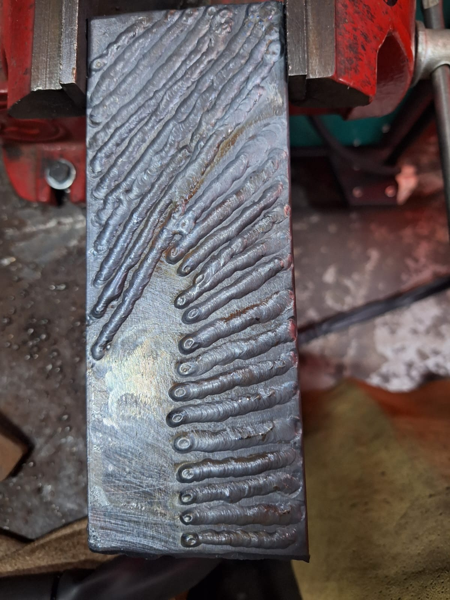
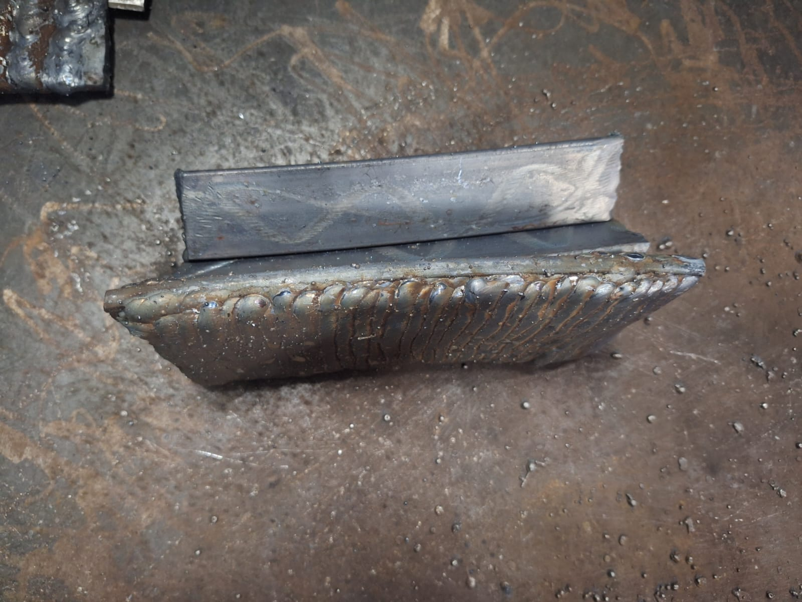
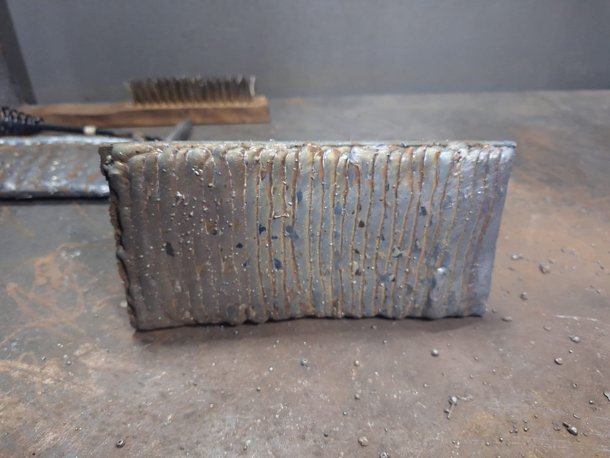
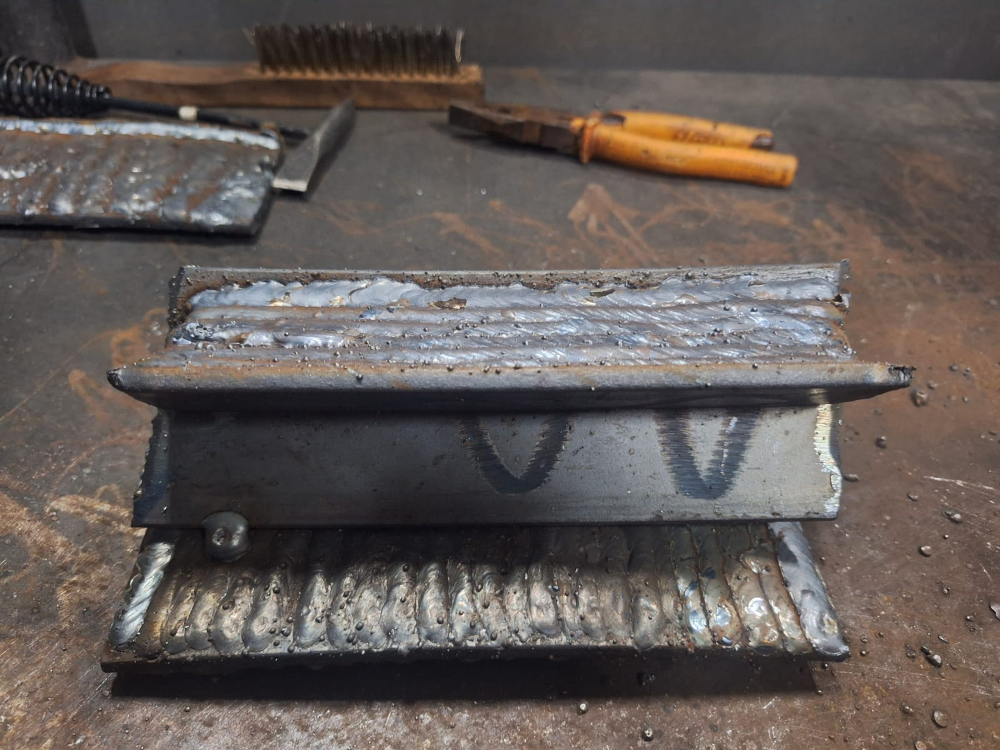
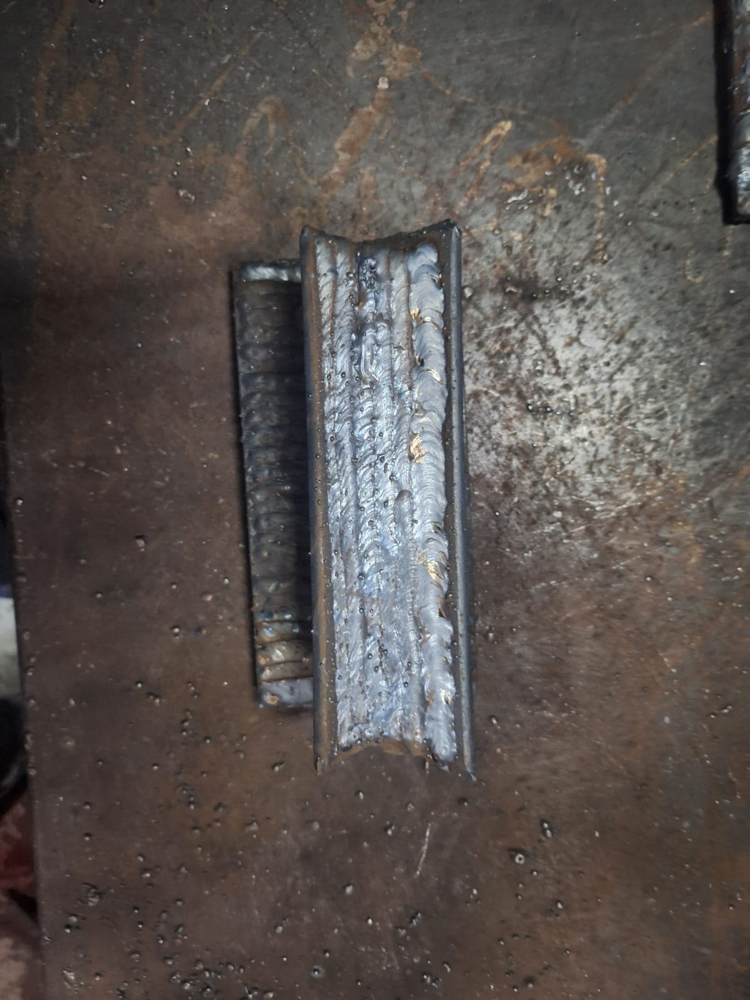
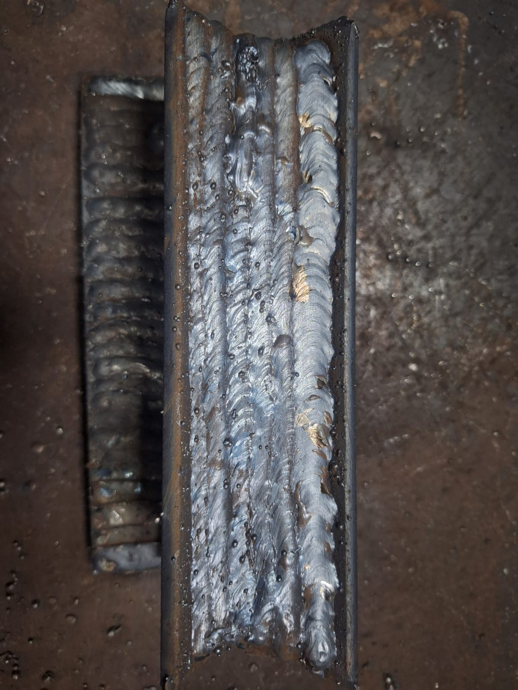

# Welding

Currently taking welding classes at SENAI. Learning new fabrication skills for multiple projects.

## Why Welding

- [[Chevette]] bodywork - cyberpunk nomad patchwork style
- [[Toyota Bandeirante]] roof rack (bagageiro)

Both projects need metalwork, and paying someone else to do it isn't the maker way.

## The Classes

### TIG (December 2025)

First class. Super fun. Finally learned how to use the welder I bought over two years ago. Yes, the machine sat there for two years waiting for me to learn how to use it properly. Classic maker move.

TIG is the precision process. Clean welds, good for thinner materials, requires both hands and a foot pedal. It's like patting your head and rubbing your belly while threading a needle.

#### The Sibling Rivalry

Took the class with my brother. Day one was humbling. He picked it up almost immediately while I was struggling to keep the arc stable.

His welds on the left, mine on the right. The difference speaks for itself.

#### The Redemption

But I kept pushing. By the end of the course, the coordination started clicking. Foot pedal, torch angle, filler rod feed. All the separate things finally started working together.

Not perfect, but a far cry from day one. And honestly, my best work wasn't even photographed - the 90-degree angle joints came out clean as hell. Of course I didn't think to capture those. Classic.

#### Next Steps

Should have gotten more pics, but there'll be more chances. I have my own TIG machine sitting at home now - just need to buy the argon tank and I can practice whenever. The two-year wait for that machine is finally paying off.

### MIG/MAG (Current)

Currently enrolled. Learning a different process: wire-fed, faster, more forgiving. Good for the heavier structural work the car projects will need.

#### The Boys Are Back

This time it's a full family affair. Brother's taking the class again, and dad tagged along too.

Plot twist: I'm doing better than my brother this time. The tables have turned. I've been able to self-diagnose problems and course correct on the fly. The teacher even used some of my welds as examples for other students. Redemption arc complete.

Having this as family time with the boys has been unexpectedly great. Different vibe from sitting around watching TV together.

#### Day 1: Spots and Strings

First practice day was all about building muscle memory. Start with spot welds to get a feel for the trigger, then move on to running strings.

Coming from TIG, MIG feels almost like cheating. No foot pedal, no filler rod in the other hand, just point and squeeze. The wire feeds itself, the gas flows automatically. After the coordination nightmare of TIG, this is refreshingly straightforward.

#### Week 1: Layer Cake and Groove Fills

By the end of the first week (3 days of practice), we moved on to building up material. Filling a plate layer by layer, then tackling a 45-degree groove weld.

The hands are getting steadier. The beads are getting more consistent. That initial nervousness of "am I doing this right?" is fading into actual confidence. The groove fill especially. Seeing the layers stack up clean is satisfying in a way that's hard to explain.

### SMAW (Next Month)

Stick welding. The classic. Joining next month to round out the skill set.

## SENAI

SENAI (Serviço Nacional de Aprendizagem Industrial) is Brazil's industrial training network. They offer practical, hands-on courses in trades like welding, machining, and electrical work. The quality is solid and the facilities are well-equipped.

## Night School Life

Taking night classes on subjects completely unrelated to my day job has been a lot of fun. Also very tiring. But the courses are only two weeks each, so I've been able to sprinkle them around without taking away too much from family time.

There's something satisfying about learning with your hands after spending all day in front of a screen.

## Fun Side Effect: Noticing Bad Work Everywhere

New favorite term: **galvanic corrosion**.

Now I can't unsee it. The counterintuitive part: you'd think "might as well use stainless screws, they're almost as cheap and won't rust." Wrong. When you mix dissimilar metals, the more noble one (stainless) causes the less noble one (carbon steel) to corrode _faster_. The stainless screw becomes a little battery anode, and the carbon steel around it pays the price.

So that rusted-out hole around an otherwise pristine screw on a handrail or water fountain? That's galvanic corrosion. Point and laugh.

This is the curse of learning a trade. You start noticing every shortcut and mistake in the wild. Ignorance was bliss.

## The Roadmap

### How I Got Here

1. Bought an ESAB Rogue machine that works on both 127V and 220V. Perfect for my house's weird electrical situation.
2. Quickly realized I didn't know shit.
3. Thought stick welding seemed like a good starting point. It wasn't.
4. Machine sat unused for about a year until SENAI opened welding classes.
5. Joined TIG class because my machine does that.
6. Joined MIG class because that's probably what we'll use most on car projects.
7. SMAW class next month to round out the skill set.

### Still Need To

- [ ] Research and acquire an argon tank for TIG
- [ ] Research MIG/MAG machines (looking for small and cheap)
- [ ] Get a gas tank for the MIG setup

#### Flux Core as a Cheap Alternative

Flux core wire could be a budget option to get started with MIG without the gas tank investment. The wire has flux inside that creates its own shielding.

**Pros:** No gas needed, works outdoors where wind would blow shielding gas away, better penetration on thick/dirty metal.

**Cons:** More spatter, slag to chip off (like stick), uglier welds, more smoke/fumes, not great for thin sheet metal.

For structural stuff and floor patches? Flux core would work fine. For visible bodywork? Want gas for that clean look. Could grab some flux core wire to practice at home while saving up for the proper gas setup.

### First Real Projects

- [ ] Dog gates for the wife
- [ ] Small welding table for the garage
- [ ] Clean up the [[Bandeirante Power Steering]] mounts (the wizard's stick welds aren't pretty, I can do better with MIG)

The dog gates are simple enough to be a good first "real" project. The welding table is meta: build a thing to help build more things.

### [[Chevette]] Welding Plan

This is the big one. The whole reason I'm learning.

1. Patch the floor (it's... not great)
2. Bodywork repairs
3. Roll cage
4. Custom bumpers

Each step gets progressively harder. Floor patches are relatively forgiving. A roll cage needs to be structural and safe. By the time I get to custom bumpers I should actually know what I'm doing.

## Related

- [[Maker]] - Fabrication skills
- [[Cars]] - Main use case
- [[Woodworking]] - Another fabrication skill
- [[Frontend Masters]] - Different kind of learning
